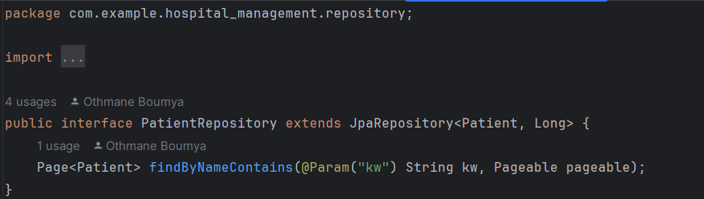

# Compte Rendu

## Ennoce

Ce TP consiste à mettre en œuvre une application Web JEE base sur Spring MVC, Thylemeaf et Spring Data JPA qui permet de gérer les patients.
L'application permet:
- Afficher les patients
- Chercher les patients par leurs noms
- Supprimer un patient

## Conception

## Capture D'ecran

#### Architecure du Projet

#### Class
###### Patient

### Repositories

### Web Controller

### Demo

